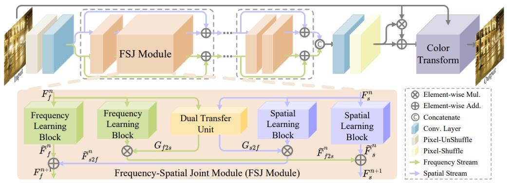

# [ICCV 2023] FSI
This is the official PyTorch implementation of the paper [FSI: Frequency and Spatial Interactive Learning for Image Restoration in Under-Display Cameras](https://openaccess.thecvf.com/content/ICCV2023/papers/Liu_FSI_Frequency_and_Spatial_Interactive_Learning_for_Image_Restoration_in_ICCV_2023_paper.pdf).

## Contents
- [Overview](#overview)
- [Contribution](#contribution)
- [Requirements and dependencies](#requirements-and-dependencies)
- [Results](#results)
- [Dataset](#dataset)
- [Test](#test)
- [Train](#train)
- [Citation](#citation)
- [Contact](#contact)
- [Acknowledgement](#acknowledgement)

## Overview


### Contribution
* We propose a novel frequency and spatial interactive learning network (FSI), which is the first work to introduce frequency learning into UDC image restoration. By learning in the frequency domain, our method effectively eliminates the various diffraction and reconstructs the textures.
* We propose a frequency-spatial joint (FSJ) module, which introduces a new perspective to explore the union of information in frequency and spatial domains, providing inspiration for other PSF-conditional tasks.
* Extensive experiments demonstrate that the proposed method can significantly outperform existing SOTA methods in three widely-used UDC benchmarks. 

## Requirements and dependencies
* python 3.6 (recommend to use [Anaconda](https://www.anaconda.com/))
* pytorch == 1.8.0
* torchvision == 0.9.0
* opencv-python == 4.6.0
* scikit-image == 0.19.3
* scipy == 1.7.3
* matplotlib == 3.5.3
* imageio == 2.23.0
* DISTS-pytorch == 0.1
* lpips == 0.1.4
* Pillow == 9.3.0
* numpy == 1.21.6
* warmup_scheduler == 0.3

## Results
The output results on P-OLED, T-OLED and SYNTH can be downloaded from [google drive](https://drive.google.com/drive/folders/1YETPY8dY1UnODLVe8k2VhrlinIR9mibm?usp=sharing).

## Dataset
The datasets are available at [POLED](https://drive.google.com/file/d/1M1mE-MfSPiMhj1fRvfFMhkRRa3mvEocJ/view?usp=sharing) containing the pre-processed UDC images, [TOLED](https://drive.google.com/file/d/1ig6BROpAI-2fgM9YnIquyM5LMe2UY4Qq/view?usp=sharing) and [SYNTH](https://drive.google.com/file/d/1ctYHU70TZlQzVwAR4yOA1G-c1gsaWqzX/view?usp=sharing).

## Test
1. Clone this github repo
```
git clone https://github.com/ChengxuLiu/FSI.git
cd FSI
```
2. Prepare testing dataset and modify "testroot" in `./options/base_options.py`
3. Run test
```
python test.py
```

## Train
1. Clone this github repo
```
git clone https://github.com/ChengxuLiu/FSI.git
cd FSI
```
2. Prepare training dataset and modify "dataroot" in `./options/base_options.py`
3. Run training
```
python train.py
```
4. The models are saved in `./checkpoints`


## Citation
If you find the code and pre-trained models useful for your research, please consider citing our paper. :blush:
```
@inproceedings{liu2023fsi,
  title={FSI: Frequency and Spatial Interactive Learning for Image Restoration in Under-Display Cameras},
  author={Liu, Chengxu and Wang, Xuan and Li, Shuai and Wang, Yuzhi and Qian, Xueming},
  booktitle={Proceedings of the IEEE/CVF International Conference on Computer Vision},
  pages={12537--12546},
  year={2023}
}
``` 

## Contact
If you meet any problems, please describe them in issues or contact:
* Chengxu Liu: <liuchx97@gmail.com>

## Acknowledgement
The code of FSI is built upon [BNUDC](https://github.com/JaihyunKoh/BNUDC/tree/main) and [LaMa](https://github.com/advimman/lama), and we express our gratitude to these awesome projects.
